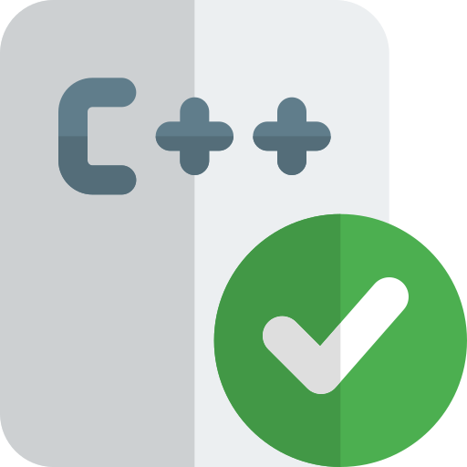

# Hallo, ich bin Joschy1976 (Sven)👋

 Ich bin ein Full-Stack-Entwickler

    
    #include <iostream>
    #include <string>
    #include <vector>
    #include <map>

    class Joschy1976 {
    public:
    std::map<std::string, std::vector<std::string>> aboutme;
    Sven() {
        aboutme["email"] = {"joschy0709@gmail.com"};
        aboutme["personal info"] = {"Sven", "Janorschke", "47", "Male"};
        aboutme["portfolio"] = {"Coming soon"};
        aboutme["location"] = {"Germany", "Nordrhein-Westfalen"};
        }
    };
[][linkedin]

[linkedin]: https://www.linkedin.com/in/sven-janorschke-72a1362ba/
# 💬 Gerne könnt Ihr mich Kontaktieren .

# ⚡ Fun Fact: Wenn ein Programmierer sagt, dass etwas 'gerade funktioniert', bedeutet das    	 	           normalerweise, dass es tatsächlich funktioniert, aber niemand weiß warum.

# 🤔 Ich arbeite mit:
   

    <!-- HTML 5 -->
    
    <!-- CSS -->
    
    <!-- JavaScript -->
    
    <!-- Bootstrap -->
    
    <!-- C# -->
    
    <!-- C++ -->
    
    <!-- Java -->
    
    <!-- Python -->
    
    <!-- React -->
    
    <!-- Node.js -->
    
    <!-- GitHub -->
    
    <!-- PostgreSQL -->
    
    <!-- MongoDB -->
    
     <!-- NPM -->
    
    <!-- Angular -->
    
    <!-- Express.js -->
    

